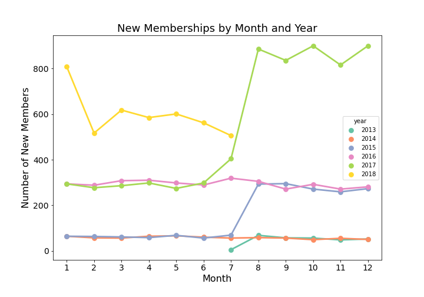

# Starbucks Customer Segmentation using K-Means Clustering

## Problem Statement

Conducting analysis on a company’s customer base and sending personalized campaigns to high value targets has massive benefits in any industry. Using unsupervised learning, I will implement a K-Means cluster analysis for customer segmentation and targeted marketing outreach for Starbucks. This type of analysis can be used by Starbucks to automate promotional outreach and reward fulfillment, as well as measurement and tracking of spending behaviors and other KPIs.

## Executive Summary

For this project I used [Starbucks customer data](https://www.kaggle.com/ihormuliar/starbucks-customer-data) that includes transactions, demographics and promotional offer data from their rewards program. The dataset includes 306,534 events related to 17,000 customers and 10 event types over the course of a 30-days. One of the main tasks of this project is to synthesize these three different datasets and use K-Means cluster analysis to deep dive into each customer segment for business insights and recommendations.

Customer segmentation is the process of dividing customers into groups based on common characteristics so companies can market and sell to each group effectively and appropriately. The goal is to maximize the value of each customer to the business. In business-to-consumer marketing, companies like Starbucks often segment customers according to demographics and spending habits. This also helps these companies communicate via the appropriate channels for the segment, which might be email, social media posts, or app notifications, depending on the customer. This helps companies also focus on the most profitable customers and potentially improve customer service and product offerings.

## Project Workflow

### Part 1: Overview, Data Cleaning & EDA

[1-Overview_Cleaning_&_EDA.ipynb](code/1-Overview_Cleaning_&_EDA.ipynb)

This notebook gives an overview of the project, data cleaning of each of the 3 datasets, and initial exporatory data analysis (EDA).

### Part 2: Dataset Merging & RFM Metrics

[2-More_Preprocessing_Merging_&_RFM_Metrics.ipynb](code/2-More_Preprocessing_Merging_&_RFM_Metrics.ipynb)

This notebook includes more data preprocessing, steps taken to aggregate and merge the datasets, as well as RFM (Recency, Frequency, and Monetary) Scores calculated from the data.

### Part 3: Cluster Analysis

[3-Unsupervised_Learning_&_Clustering.ipynb](code/3-Unsupervised_Learning_&_Clustering.ipynb)

This notebook includes dimensionality reduction with PCA, analysis done to find the number of clusters (k) for K-Means cluster analysis, as well as an attempt at DBSCAN that proved to be not a good application with this dataset.

### Part 4: Post Hoc Analysis and Customer Insights

[4-Post_Hoc_Analysis_&_Conclusions.ipynb](code/4-Post_Hoc_Analysis_&_Conclusions.ipynb)

This notebook includes a post hoc analysis of the 6 clusters in order to build customer personas for each of the segments to be used for marketing and promotional purposes.

## Recommendations

- Segment 0: Don’t bother with many promotions.
- Segment 1: Do well with promos, and have high potential with their incomes and highest $/trans. but they only represent small % of customers.
- Segment 2: Informational offers - if targeting them with a different type of promo make it shorter duration, lower difficulty, but offer a lower reward.
- Segment 3: Discount offers - Loyalty in terms of membership lengths, feel free to send them more difficult offers to complete but with higher rewards.
- Segment 4: BOGO offers but generally have lower # of trans. possibly because of this. Older members with higher incomes, they are likely to redeem rewards so choose difficulty and reward levels accordingly.
- Segment 5: Recent members (<1 year) and not a lot going on. Possibly need more time & demographic info (left a lot of this blank) to better understand their spending habits.

## Final Insights

Clusters are separated by relevant metrics for related marketing decisions to be made with each of the segments by Starbucks. Gender, Income and Age seemed to have less of a direct impact compared to amount $ spent, number of transactions, promotional offers, and length of membership. This work highlighted that the bulk of a data science problem is often the data cleaning and wrangling. There is longer term potential for this project to keep developing these customer segments and iterating through this workflow with even more customer data.

## References
1. Data Source: https://www.kaggle.com/ihormuliar/starbucks-customer-data
2. https://seifip.medium.com/starbucks-offers-advanced-customer-segmentation-with-python-737f22e245a4
3. https://www.barilliance.com/rfm-analysis/
4. https://formation.ai/blog/how-starbucks-became-1-in-customer-loyalty/
5. https://lifetimes.readthedocs.io/en/latest/
6. https://www.natasshaselvaraj.com/customer-segmentation-with-python/
7. https://towardsdatascience.com/find-your-best-customers-with-customer-segmentation-in-python-61d602f9eee6
8. https://www.datacamp.com/community/tutorials/introduction-customer-segmentation-python
9. https://clevertap.com/blog/rfm-analysis/
10. https://www.kaggle.com/regivm/rfm-analysis-tutorial
11. https://github.com/alghsaleh/starbucks-customers-segmentation/blob/master/utilities.py
12. https://medium.com/capillary-data-science/rfm-analysis-an-effective-customer-segmentation-technique-using-python-58804480d232
